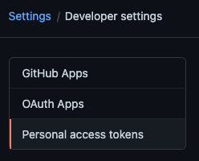
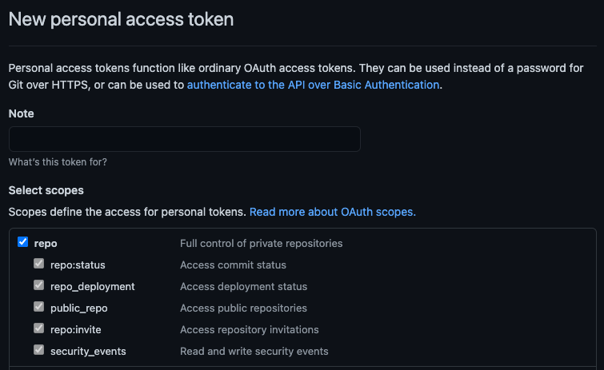
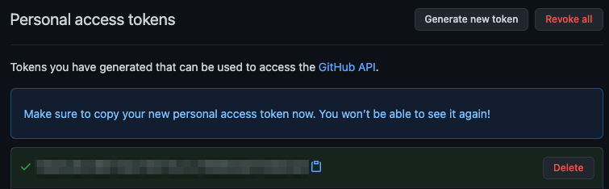

## Private modules and repositories

There maybe instances where you want to load a remote module that is located in
a _private_ repository, like a private repository on GitHub.

Deno supports sending bearer tokens when requesting a remote module. Bearer
tokens are the predominate type of access token used with OAuth 2.0 and is
broadly supported by hosting services (e.g. GitHub, Gitlab, BitBucket,
Cloudsmith, etc.).

### DENO_AUTH_TOKENS

The Deno CLI will look for an environment variable named `DENO_AUTH_TOKENS` to
determine what authentication tokens it should consider using when requesting
remote modules. The value of the environment variable is in the format of a _n_
number of tokens deliminated by a semi-colon (`;`) where each token is in the
format of `{token}@{hostname[:port]}`.

For example a single token for would look something like this:

```sh
DENO_AUTH_TOKENS=a1b2c3d4e5f6@deno.land
```

And multiple tokens would look like this:

```sh
DENO_AUTH_TOKENS=a1b2c3d4e5f6@deno.land;f1e2d3c4b5a6@example.com:8080
```

When Deno goes to fetch a remote module, where the hostname matches the hostname
of the remote module, Deno will set the `Authorization` header of the request to
the value of `Bearer {token}`. This allows the remote server to recognize that
the request is an authorized request tied to a specific authenticated user, and
provide access to the appropriate resources and modules on the server.

### GitHub

To be able to access private repositories on GitHub, you would need to issue
yourself a _personal access token_. You do this by logging into GitHub and going
under _Settings -> Developer settings -> Personal access tokens_:



You would then choose to _Generate new token_ and give your token a description
and appropriate access:



And once created GitHub will display the new token a single time, the value of
which you would want to use in the environment variable:



In order to access modules that are contained in a private repository on GitHub,
you would want to use the generated token in the `DENO_AUTH_TOKENS` environment
variable scoped to the `raw.githubusercontent.com` hostname. For example:

```sh
DENO_AUTH_TOKENS=a1b2c3d4e5f6@raw.githubusercontent.com
```

This should allow `Deno` to access any modules that the user to who the token was
issued for has access to.

When the token is incorrect, or the user does not have access to the module,
GitHub will issue a `404 Not Found` status, instead of an unauthorized status.
So if you are getting errors that the modules you are trying to access are not
found on the command line, check the environment variable settings and the
personal access token settings.

In addition, `deno run -L debug` should print out a debug message about the
number of tokens that are parsed out of the environment variable. It will print
an error message if it feels any of the tokens are malformed. It won't print any
details about the tokens for security purposes.
