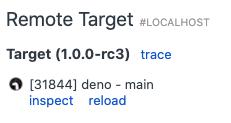
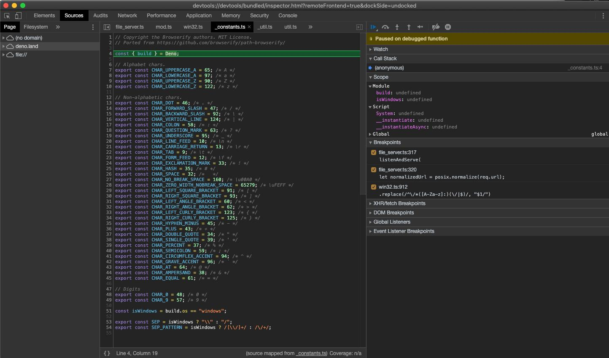
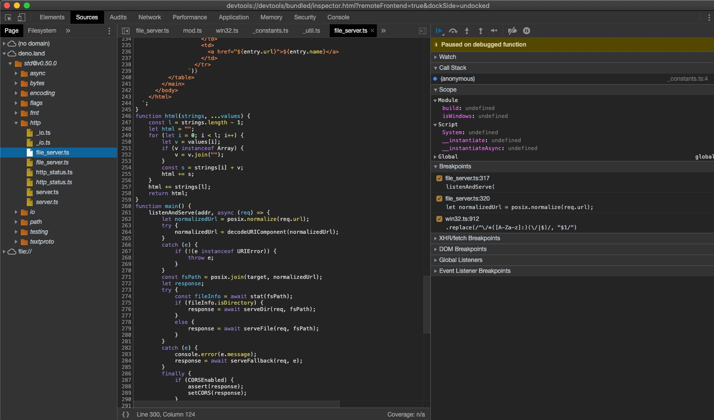
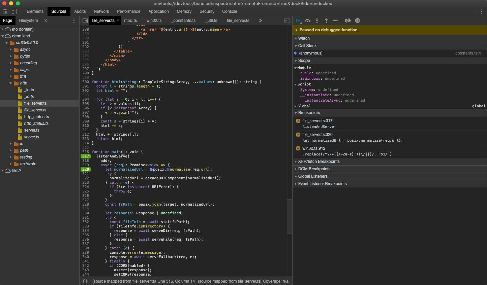
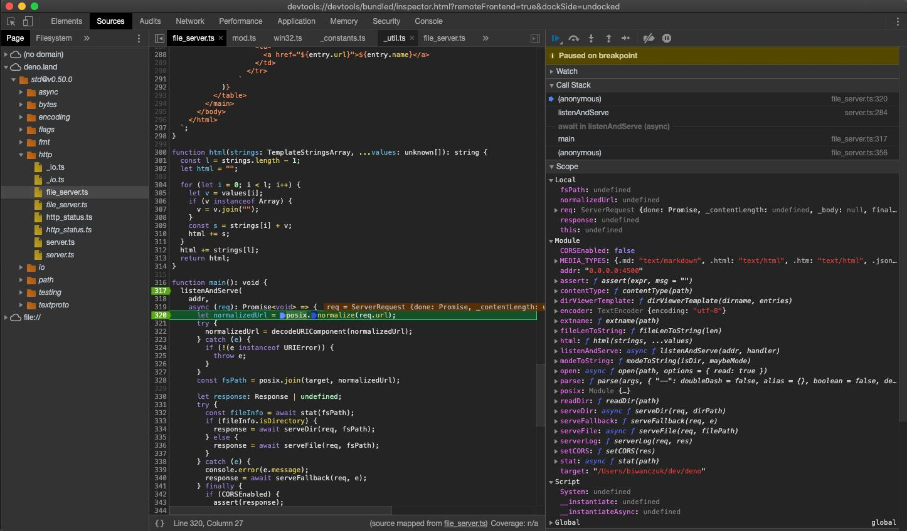
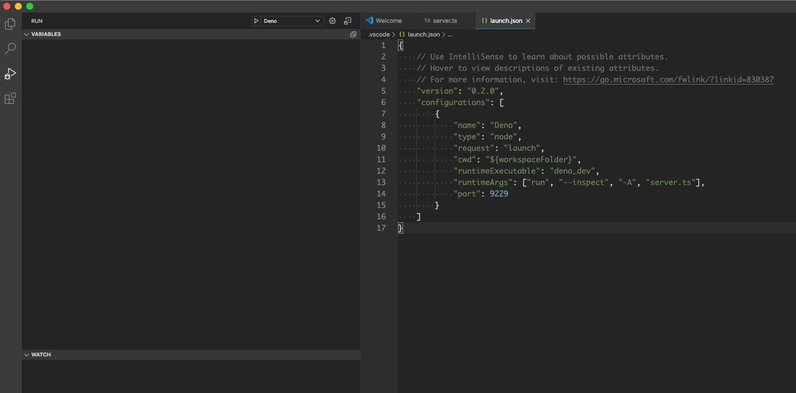
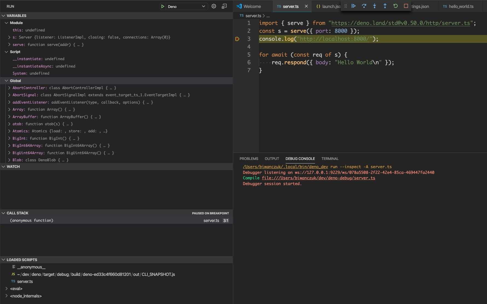

## Debugger

Deno supports [V8 Inspector Protocol](https://v8.dev/docs/inspector).

It is possible to debug Deno programs using Chrome Devtools or other clients
that support the protocol (eg. VSCode).

To activate debugging capabilities run Deno with `--inspect` or `--inspect-brk`
flag.

`--inspect` flag allows to attach debugger at any point in time, while
`--inspect-brk` will wait for debugger being attached and pause execution on the
first line of code.

### Chrome Devtools

Let's try debugging a program using Chrome Devtools; for this purpose we'll use
[file_server.ts](https://deno.land/std@v0.50.0/http/file_server.ts) from `std`;
a static file server.

Use `--inspect-brk` flag to break execution on the first line.

```shell
$ deno run --inspect-brk --allow-read --allow-net https://deno.land/std@v0.50.0/http/file_server.ts
Debugger listening on ws://127.0.0.1:9229/ws/1e82c406-85a9-44ab-86b6-7341583480b1
Download https://deno.land/std@v0.50.0/http/file_server.ts
Compile https://deno.land/std@v0.50.0/http/file_server.ts
...
```

Open `chrome://inspect` and click `Inspect` next to target:



It might take a few seconds after opening the devtools to load all modules.



You might notice that Devtools paused execution on the first line of
`_constants.ts` instead of `file_server.ts`. This is an expected behavior and is
caused by the way ES modules are evaluated by V8 (`_constants.ts` is left-most,
bottom-most dependency of `file_server.ts` so it is evaluated first).

At this point all source code is available in the Devtools, so let's open up
`file_server.ts` and add a breakpoint there; go to "Sources" pane and expand the
tree:



_Looking closely you'll find duplicate entries for each file; one written
regularly and one in italics. The former is compiled source file (so in case of
`.ts` files it will be emitted JavaScript source), while the latter is a source
map for the file._

Add a breakpoint in `listenAndServe` method:



As soon as we've added the breakpoint Devtools automatically opened up source
map file, which allows us step through the actual source code that includes
types.

Now that we have our breakpoints set, we can resume the execution of our script
so that we might inspect an incoming request. Hit the Resume script execution
button to do so. You might even need to hit it twice!

Once our script is running again, let's send a request and inspect it in
Devtools:

```
$ curl http://0.0.0.0:4500/
```



At this point we can introspect contents of the request and go step-by-step to
debug the code.

### VSCode

Deno can be debugged using VSCode.

Official support in plugin is being worked on -
https://github.com/denoland/vscode_deno/issues/12

We can still attach debugger by manually providing a `launch.json` config:

```json
{
  "version": "0.2.0",
  "configurations": [
    {
      "name": "Deno",
      "type": "node",
      "request": "launch",
      "cwd": "${workspaceFolder}",
      "runtimeExecutable": "deno",
      "runtimeArgs": ["run", "--inspect-brk", "-A", "<entry_point>"],
      "port": 9229
    }
  ]
}
```

**NOTE**: Replace `<entry_point>` with actual script name.

This time let's try with local source file, create `server.ts`:

```ts
import { serve } from "https://deno.land/std@v0.50.0/http/server.ts";
const server = serve({ port: 8000 });
console.log("http://localhost:8000/");

for await (const req of server) {
  req.respond({ body: "Hello World\n" });
}
```

Change `<entry_point>` to `server.ts` and run created configuration:





### JetBrains IDEs

You can debug Deno using your JetBrains IDE by right-clicking the file you want
to debug and selecting the `Debug 'Deno: <file name>'` option. This will create
a run/debug configuration which has no permission flags set, so to change that
you need to modify the run/debug configuration and change the `Arguments` field
with the required flags.

### Other

Any client that implements Devtools protocol should be able to connect to Deno
process.

### Limitations

Devtools support is still immature, there are some functionalities that are
known to be missing/buggy:

- autocomplete in Devtools' Console causes Deno process to exit
- profiling and memory dumps might not work correctly
