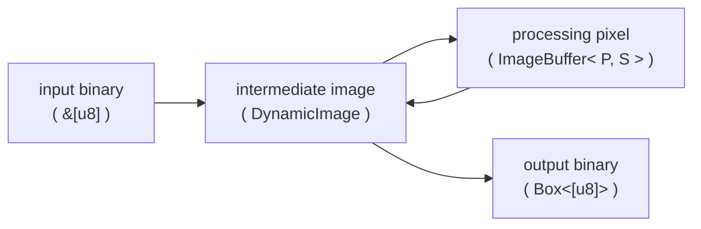

# deno_canvas

Extension that implements various OffscreenCanvas related APIs.

## Image processing architecture in Rust

The architecture of image processing in Rust is rely on the structure of
[image](https://github.com/image-rs/image) crate.\
If the input is a image of binary, it convert to an intermediate image
(`DynamicImage` in `image`) with using a decoder corresponding to its image
formats.\
After converting to an intermediate image, it can process various way for
example, to use the pixel processong operation
[imageops](https://github.com/image-rs/image?tab=readme-ov-file#image-processing-functions)
supplied by `image`.\
On the other hand, there can also to implement your own pixel processong
operation to refer to
[the implementation of imageops as here](https://github.com/image-rs/image/blob/4afe9572b5c867cf4d07cd88107e8c49354de9f3/src/imageops/colorops.rs#L156-L182)
or [image_ops.rs module](./image_ops.rs).\
You can treat any bit depth that supported by `image` with generics in the
processing pixel layer.
