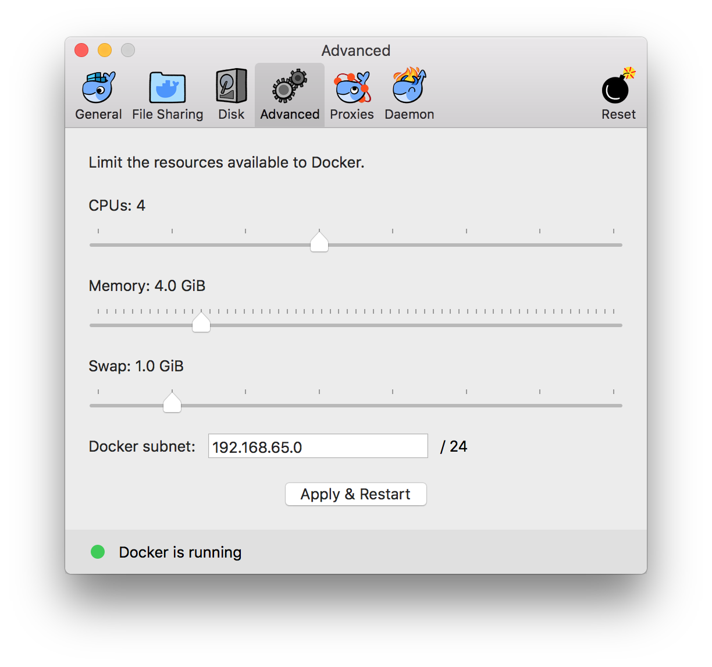

# Docker Compose Tools

[Docker Compose](https://github.com/docker/compose/blob/master/README.md) is a tool for defining and running multi-container Docker applications. With Compose, you use a Compose file to configure your application's services. Then, using a single command, you create and start all the services from your configuration.

Compose is great for development, testing, and staging environments, as well as CI workflows. To learn more, see [documentation](https://github.com/docker/docker.github.io/blob/master/compose/overview.md).

You can play with docker-compose tool in the subdirectory [deno](deno), or use the [Makefile](Makefile) for common use cases.

```
make build
make run_base
make run_prebuild
make run_build
```

Note: to run this docker-compose setup, you need more than 4G memory allocated to Docker.


