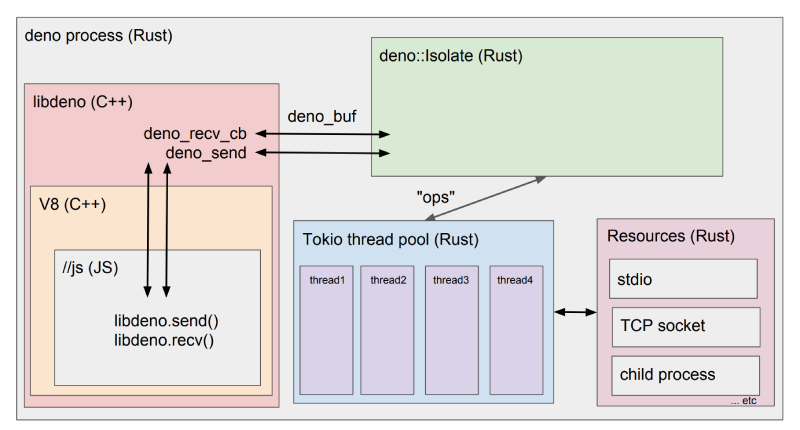

# Deno Manual

[toc]

## Disclaimer

A word of caution: Deno is very much under development. We encourage brave early
adopters, but expect bugs large and small. The API is subject to change without
notice. [Bug reports](https://github.com/denoland/deno/issues) do help!

## Introduction

A secure JavaScript/TypeScript runtime built with V8, Rust, and Tokio

### Philosophy

Deno aims to be a productive and secure scripting environment for the modern
programmer.

Deno will always be distributed as a single executable. Given a URL to a Deno
program, it is runnable with nothing more than
[the 10 megabyte zipped executable](https://github.com/denoland/deno/releases).
Deno explicitly takes on the role of both runtime and package manager. It uses a
standard browser-compatible protocol for loading modules: URLs.

Deno provides security guarantees about how programs can access your system with
the default being the most restrictive secure sandbox.

Deno provides <a href="https://github.com/denoland/deno/tree/master/std">a set
of reviewed (audited) standard modules</a> that are guaranteed to work with
Deno.

### Goals

- Support TypeScript out of the box.

- Uses "ES Modules" and does not support `require()`. Like the browser, allows
  imports from URLs:

  ```ts
  import * as log from "https://deno.land/std/log/mod.ts";
  ```

- Remote code is fetched and cached on first execution, and never updated until
  the code is run with the `--reload` flag. (So, this will still work on an
  airplane. See `~/.deno/src` for details on the cache.)

- File system and network access can be controlled in order to run sandboxed
  code. Access between V8 (unprivileged) and Rust (privileged) is only done via
  serialized messages. This makes it easy to audit. For example, to enable write
  access use the flag `--allow-write` or for network access `--allow-net`.

- Only ship a single executable.

- Always dies on uncaught errors.

- Browser compatible: The subset of Deno programs which are written completely
  in JavaScript and do not use the global `Deno` namespace (or feature test for
  it), ought to also be able to be run in a modern web browser without change.

- [Aims to support top-level `await`.](https://github.com/denoland/deno/issues/471)

- Be able to serve HTTP efficiently.
  ([Currently it is relatively slow.](https://deno.land/benchmarks.html#req-per-sec))

<!-- prettier-ignore-start -->
<!-- see https://github.com/prettier/prettier/issues/3679 -->

- Provide useful tooling out of the box:
    - dependency inspector (`deno info`)
    - code formatter (`deno fmt`),
    - bundling (`deno bundle`)
    - runtime type info (`deno types`)
    - test runner (`deno test`)
    - command-line debugger (`--debug`)
      [not yet](https://github.com/denoland/deno/issues/1120)
    - linter (`deno lint`) [not yet](https://github.com/denoland/deno/issues/1880)

<!-- prettier-ignore-end -->

### Non-goals

- No `package.json`.

- No npm.

- Not explicitly compatible with Node.

## Setup

### Binary Install

Deno works on OSX, Linux, and Windows. Deno is a single binary executable. It
has no external dependencies.

[deno_install](https://github.com/denoland/deno_install) provides convenience
scripts to download and install the binary.

Using Shell:

```shell
curl -fsSL https://deno.land/x/install/install.sh | sh
```

Using PowerShell:

```shell
iwr https://deno.land/x/install/install.ps1 -useb | iex
```

Using [Scoop](https://scoop.sh/) (windows):

```shell
scoop install deno
```

Using [Homebrew](https://brew.sh/) (mac):

```shell
brew install deno
```

To install from source:

```shell
cargo install deno_cli
```

Deno binaries can also be installed manually, by downloading a tarball or zip
file at
[github.com/denoland/deno/releases](https://github.com/denoland/deno/releases).
These packages contain just a single executable file. You will have to set the
executable bit on Mac and Linux.

Once it's installed and in your `$PATH`, try it:

```shell
deno https://deno.land/welcome.ts
```

### Build from source

Clone on Linux or Mac:

```bash
git clone --recurse-submodules https://github.com/denoland/deno.git
```

On Windows, a couple extra steps are required to clone because we use symlinks
in the repository. First
[enable "Developer Mode"](https://www.google.com/search?q=windows+enable+developer+mode)
(otherwise symlinks would require administrator privileges). Then you must set
`core.symlinks=true` before the checkout is started.

```bash
git config --global core.symlinks=true
git clone --recurse-submodules https://github.com/denoland/deno.git
```

Now we can start the build:

```bash
# Build.
cargo build -vv

# Run.
./target/debug/deno tests/002_hello.ts

# Test.
cargo test

# Format code.
./tools/format.py
```

#### Prerequisites

To ensure reproducible builds, Deno has most of its dependencies in a git
submodule. However, you need to install separately:

1. [Rust](https://www.rust-lang.org/en-US/install.html) >= 1.36.0
2. Python 2.
   [Not 3](https://github.com/denoland/deno/issues/464#issuecomment-411795578).

Extra steps for Mac users: install [XCode](https://developer.apple.com/xcode/)
:(

Extra steps for Windows users:

<!-- prettier-ignore-start -->
<!-- see https://github.com/prettier/prettier/issues/3679 -->

1. Add `python.exe` to `PATH` (e.g. `set PATH=%PATH%;C:\Python27\python.exe`)
2. Get [VS Community 2017](https://www.visualstudio.com/downloads/) with
   "Desktop development with C++" toolkit and make sure to select the following
   required tools listed below along with all C++ tools.
    - Windows 10 SDK >= 10.0.17134
    - Visual C++ ATL for x86 and x64
    - Visual C++ MFC for x86 and x64
    - C++ profiling tools
3. Enable "Debugging Tools for Windows". Go to "Control Panel" → "Programs" →
   "Programs and Features" → Select "Windows Software Development Kit - Windows
   10" → "Change" → "Change" → Check "Debugging Tools For Windows" → "Change" ->
   "Finish".
4. Make sure you are using git version 2.19.2.windows.1 or newer.

<!-- prettier-ignore-end -->

#### Other useful commands

```bash
# Call ninja manually.
ninja -C target/debug

# Build a release binary.
cargo build --release

# List executable targets.
gn --root=core/libdeno ls target/debug "//:*" --as=output --type=executable

# List build configuration.
gn --root=core/libdeno args target/debug/ --list

# Edit build configuration.
gn --root=core/libdeno args target/debug/

# Describe a target.
gn --root=core/libdeno desc target/debug/ :deno
gn help

# Update third_party modules
git submodule update

# Skip downloading binary build tools and point the build
# to the system provided ones (for packagers of deno ...).
export DENO_BUILD_ARGS="clang_base_path=/usr clang_use_chrome_plugins=false"
DENO_NO_BINARY_DOWNLOAD=1 DENO_GN_PATH=/usr/bin/gn cargo build
```

Environment variables: `DENO_BUILD_MODE`, `DENO_BUILD_PATH`, `DENO_BUILD_ARGS`,
`DENO_DIR`, `DENO_GN_PATH`, `DENO_NO_BINARY_DOWNLOAD`.

## API reference

### deno types

To get an exact reference of deno's runtime API, run the following in the
command line:

```shell
$ deno types
```

[This is what the output looks like.](https://gist.github.com/ry/46da4724168cdefa763e13207d27ede5)

### Reference websites

[TypeScript Deno API](https://deno.land/typedoc/index.html).

If you are embedding deno in a Rust program, see
[Rust Deno API](https://docs.rs/deno).

The Deno crate is hosted on [crates.io](https://crates.io/crates/deno).

## Examples

### An implementation of the unix "cat" program

In this program each command-line argument is assumed to be a filename, the file
is opened, and printed to stdout.

```ts
for (let i = 1; i < Deno.args.length; i++) {
  let filename = Deno.args[i];
  let file = await Deno.open(filename);
  await Deno.copy(Deno.stdout, file);
  file.close();
}
```

The `copy()` function here actually makes no more than the necessary kernel ->
userspace -> kernel copies. That is, the same memory from which data is read
from the file, is written to stdout. This illustrates a general design goal for
I/O streams in Deno.

Try the program:

```shell
$ deno --allow-read https://deno.land/std/examples/cat.ts /etc/passwd
```

### TCP echo server

This is an example of a simple server which accepts connections on port 8080,
and returns to the client anything it sends.

```ts
const listener = Deno.listen({ port: 8080 });
console.log("listening on 0.0.0.0:8080");
while (true) {
  const conn = await listener.accept();
  Deno.copy(conn, conn);
}
```

When this program is started, the user is prompted for permission to listen on
the network:

```shell
$ deno https://deno.land/std/examples/echo_server.ts
⚠️  Deno requests network access to "listen". Grant? [a/y/n/d (a = allow always, y = allow once, n = deny once, d = deny always)]
```

For security reasons, Deno does not allow programs to access the network without
explicit permission. To avoid the console prompt, use a command-line flag:

```shell
$ deno --allow-net https://deno.land/std/examples/echo_server.ts
```

To test it, try sending data to it with netcat:

```shell
$ nc localhost 8080
hello world
hello world
```

Like the `cat.ts` example, the `copy()` function here also does not make
unnecessary memory copies. It receives a packet from the kernel and sends back,
without further complexity.

### Inspecting and revoking permissions

Sometimes a program may want to revoke previously granted permissions. When a
program, at a later stage, needs those permissions, a new prompt will be
presented to the user.

```ts
const { permissions, revokePermission, open, remove } = Deno;

// lookup a permission
if (!permissions().write) {
  throw new Error("need write permission");
}

const log = await open("request.log", "a+");

// revoke some permissions
revokePermission("read");
revokePermission("write");

// use the log file
const encoder = new TextEncoder();
await log.write(encoder.encode("hello\n"));

// this will prompt for the write permission or fail.
await remove("request.log");
```

### File server

This one serves a local directory in HTTP.

```bash
deno install file_server https://deno.land/std/http/file_server.ts --allow-net --allow-read
```

Run it:

```shell
$ file_server .
Downloading https://deno.land/std/http/file_server.ts...
[...]
HTTP server listening on http://0.0.0.0:4500/
```

And if you ever want to upgrade to the latest published version:

```shell
$ file_server --reload
```

### Reload specific modules

Sometimes we want to upgrade only some modules. You can control it by passing an
argument to a `--reload` flag.

To reload everything

`--reload`

To reload all standard modules

`--reload=https://deno.land/std`

To reload specific modules (in this example - colors and file system utils) use
a comma to separate URLs

`--reload=https://deno.land/std/fs/utils.ts,https://deno.land/std/fmt/colors.ts`

### Permissions whitelist

Deno also provides permissions whitelist.

This is an example to restrict File system access by whitelist.

```shell
$ deno --allow-read=/usr https://deno.land/std/examples/cat.ts /etc/passwd
⚠️  Deno requests read access to "/etc/passwd". Grant? [a/y/n/d (a = allow always, y = allow once, n = deny once, d = deny always)]
```

You can grant read permission under `/etc` dir

```shell
$ deno --allow-read=/etc https://deno.land/std/examples/cat.ts /etc/passwd
```

`--allow-write` works same as `--allow-read`.

This is an example to restrict host.

```ts
const result = await fetch("https://deno.land/std/examples/echo_server.ts");
```

```shell
$ deno --allow-net=deno.land allow-net-whitelist-example.ts
```

### Run subprocess

[API Reference](https://deno.land/typedoc/index.html#run)

Example:

```ts
// create subprocess
const p = Deno.run({
  args: ["echo", "hello"]
});

// await its completion
await p.status();
```

Run it:

```shell
$ deno --allow-run ./subprocess_simple.ts
hello
```

Here a function is assigned to `window.onload`. This function is called after
the main script is loaded. This is the same as
[onload](https://developer.mozilla.org/en-US/docs/Web/API/GlobalEventHandlers/onload)
of the browsers, and it can be used as the main entrypoint.

By default when you use `Deno.run()` subprocess inherits `stdin`, `stdout` and
`stderr` of parent process. If you want to communicate with started subprocess
you can use `"piped"` option.

```ts
const fileNames = Deno.args.slice(1);

const p = Deno.run({
  args: [
    "deno",
    "run",
    "--allow-read",
    "https://deno.land/std/examples/cat.ts",
    ...fileNames
  ],
  stdout: "piped",
  stderr: "piped"
});

const { code } = await p.status();

if (code === 0) {
  const rawOutput = await p.output();
  await Deno.stdout.write(rawOutput);
} else {
  const rawError = await p.stderrOutput();
  const errorString = new TextDecoder().decode(rawError);
  console.log(errorString);
}

Deno.exit(code);
```

When you run it:

```shell
$ deno run --allow-run ./subprocess.ts <somefile>
[file content]

$ deno run --allow-run ./subprocess.ts non_existent_file.md

Uncaught NotFound: No such file or directory (os error 2)
    at DenoError (deno/js/errors.ts:22:5)
    at maybeError (deno/js/errors.ts:41:12)
    at handleAsyncMsgFromRust (deno/js/dispatch.ts:27:17)
```

### Linking to third party code

In the above examples, we saw that Deno could execute scripts from URLs. Like
browser JavaScript, Deno can import libraries directly from URLs. This example
uses a URL to import a test runner library:

```ts
import { test, runIfMain } from "https://deno.land/std/testing/mod.ts";
import { assertEquals } from "https://deno.land/std/testing/asserts.ts";

test(function t1() {
  assertEquals("hello", "hello");
});

test(function t2() {
  assertEquals("world", "world");
});

runIfMain(import.meta);
```

Try running this:

```shell
$ deno run test.ts
running 2 tests
test t1 ... ok
test t2 ... ok

test result: ok. 2 passed; 0 failed; 0 ignored; 0 measured; 0 filtered out

```

Note that we did not have to provide the `--allow-net` flag for this program,
and yet it accessed the network. The runtime has special access to download
imports and cache them to disk.

Deno caches remote imports in a special directory specified by the `$DENO_DIR`
environmental variable. It defaults to the system's cache directory if
`$DENO_DIR` is not specified. The next time you run the program, no downloads
will be made. If the program hasn't changed, it won't be recompiled either. The
default directory is:

- On Linux/Redox: `$XDG_CACHE_HOME/deno` or `$HOME/.cache/deno`
- On Windows: `%LOCALAPPDATA%/deno` (`%LOCALAPPDATA%` = `FOLDERID_LocalAppData`)
- On macOS: `$HOME/Library/Caches/deno`
- If something fails, it falls back to `$HOME/.deno`

**But what if `https://deno.land/` goes down?** Relying on external servers is
convenient for development but brittle in production. Production software should
always bundle its dependencies. In Deno this is done by checking the `$DENO_DIR`
into your source control system, and specifying that path as the `$DENO_DIR`
environmental variable at runtime.

**How do you import to a specific version?** Simply specify the version in the
URL. For example, this URL fully specifies the code being run:
`https://unpkg.com/liltest@0.0.5/dist/liltest.js`. Combined with the
aforementioned technique of setting `$DENO_DIR` in production to stored code,
one can fully specify the exact code being run, and execute the code without
network access.

**It seems unwieldy to import URLs everywhere. What if one of the URLs links to
a subtly different version of a library? Isn't it error prone to maintain URLs
everywhere in a large project?** The solution is to import and re-export your
external libraries in a central `deps.ts` file (which serves the same purpose as
Node's `package.json` file). For example, let's say you were using the above
testing library across a large project. Rather than importing
`"https://deno.land/std/testing/mod.ts"` everywhere, you could create a
`deps.ts` file that exports the third-party code:

```ts
export { test, assertEquals } from "https://deno.land/std/testing/mod.ts";
```

And throughout the same project, you can import from the `deps.ts` and avoid
having many references to the same URL:

```ts
import { test, assertEquals } from "./deps.ts";
```

This design circumvents a plethora of complexity spawned by package management
software, centralized code repositories, and superfluous file formats.

### Using external type definitions

Deno supports both JavaScript and TypeScript as first class languages at
runtime. This means it requires fully qualified module names, including the
extension (or a server providing the correct media type). In addition, Deno has
no "magical" module resolution.

The out of the box TypeScript compiler though relies on both extension-less
modules and the Node.js module resolution logic to apply types to JavaScript
modules.

In order to bridge this gap, Deno supports compiler hints that inform Deno the
location of `.d.ts` files and the JavaScript code they relate to. A compiler
hint looks like this:

```ts
// @deno-types="./foo.d.ts"
import * as foo from "./foo.js";
```

Where the hint affects the next `import` statement (or `export ... from`
statement) where the value of the `@deno-types` will be substituted at compile
time instead of the specified module. Like in the above example, the Deno
compiler will load `./foo.d.ts` instead of `./foo.js`. Deno will still load
`./foo.js` when it runs the program.

**Not all type definitions are supported.**

Deno will use the compiler hint to load the indicated `.d.ts` files, but some
`.d.ts` files contain unsupported features. Specifically, some `.d.ts` files
expect to be able to load or reference type definitions from other packages
using the module resolution logic. For example a type reference directive to
include `node`, expecting to resolve to some path like
`./node_modules/@types/node/index.d.ts`. Since this depends on non-relative
"magical" resolution, Deno cannot resolve this.

**Why not use the triple-slash type reference?**

The TypeScript compiler supports triple-slash directives, including a type
reference directive. If Deno used this, it would interfere with the behavior of
the TypeScript compiler.

### Testing if current file is the main program

To test if the current script has been executed as the main input to the program
check `import.meta.main`.

```ts
if (import.meta.main) {
  console.log("main");
}
```

## Command line interface

### Flags

Use `deno help` to see the help text.

```
deno
A secure runtime for JavaScript and TypeScript built with V8, Rust, and Tokio.

Docs: https://deno.land/manual.html
Modules: https://deno.land/x/
Bugs: https://github.com/denoland/deno/issues

To run the REPL:

  deno

To execute a sandboxed script:

  deno https://deno.land/welcome.ts

To evaluate code from the command line:

  deno eval "console.log(30933 + 404)"

To get help on the another subcommands (run in this case):

  deno help run

USAGE:
    deno [OPTIONS] [SUBCOMMAND]

OPTIONS:
    -A, --allow-all                    Allow all permissions
        --allow-env                    Allow environment access
        --allow-hrtime                 Allow high resolution time measurement
        --allow-net=<allow-net>        Allow network access
        --allow-read=<allow-read>      Allow file system read access
        --allow-run                    Allow running subprocesses
        --allow-write=<allow-write>    Allow file system write access
    -c, --config <FILE>                Load compiler configuration file
        --current-thread               Use tokio::runtime::current_thread
    -h, --help                         Prints help information
        --importmap <FILE>             Load import map file
    -L, --log-level <log-level>        Set log level [possible values: debug, info]
        --no-fetch                     Do not download remote modules
        --no-prompt                    Do not use prompts
    -r, --reload=<CACHE_BLACKLIST>     Reload source code cache (recompile TypeScript)
        --seed <NUMBER>                Seed Math.random()
        --v8-flags=<v8-flags>          Set V8 command line options
        --v8-options                   Print V8 command line options
    -v, --version                      Print the version

SUBCOMMANDS:
    [SCRIPT]       Script to run
    bundle         Bundle module and dependencies into single file
    completions    Generate shell completions
    eval           Eval script
    fetch          Fetch the dependencies
    fmt            Format files
    help           Prints this message or the help of the given subcommand(s)
    info           Show info about cache or info related to source file
    install        Install script as executable
    run            Run a program given a filename or url to the source code
    test           Run tests
    types          Print runtime TypeScript declarations
    version        Print the version
    xeval          Eval a script on text segments from stdin

ENVIRONMENT VARIABLES:
    DENO_DIR        Set deno's base directory
    NO_COLOR        Set to disable color
    HTTP_PROXY      Set proxy address for HTTP requests (module downloads, fetch)
    HTTPS_PROXY     Set proxy address for HTTPS requests (module downloads, fetch)
```

### Environmental variables

There are several env vars that control how Deno behaves:

`DENO_DIR` defaults to `$HOME/.deno` but can be set to any path to control where
generated and cached source code is written and read to.

`NO_COLOR` will turn off color output if set. See https://no-color.org/. User
code can test if `NO_COLOR` was set without having `--allow-env` by using the
boolean constant `Deno.noColor`.

### Shell completion

You can generate completion script for your shell using the
`deno completions <shell>` command. The command outputs to stdout so you should
redirect it to an appropriate file.

The supported shells are:

- zsh
- bash
- fish
- powershell
- elvish

Example:

```shell
deno completions bash > /usr/local/etc/bash_completion.d/deno.bash
source /usr/local/etc/bash_completion.d/deno.bash
```

### V8 flags

V8 has many many internal command-line flags, that you can see with
`--v8-options`.
[It looks like this.](https://gist.github.com/ry/1c5b080dcbdc6367e5612392049c9ee7)

Particularly useful ones:

```
--async-stack-trace
```

### Bundling

`deno bundle [URL]` will output a single JavaScript file, using
[AMD](https://en.wikipedia.org/wiki/Asynchronous_module_definition), which
includes all dependencies of the specified input.

```
> deno bundle https://deno.land/std/examples/colors.ts
Bundling "colors.bundle.js"
Emitting bundle to "colors.bundle.js"
9.2 kB emitted.
```

To run then bundle in Deno use

```
deno https://deno.land/std/bundle/run.ts colors.bundle.js
```

Bundles can also be loaded in the web browser with the assistance of
[RequireJS](https://requirejs.org/). Suppose we have a bundle called
`website.bundle.js`, then the following HTML should be able to load it:

```html
<script src="https://cdnjs.cloudflare.com/ajax/libs/require.js/2.3.6/require.min.js"></script>
<script src="website.bundle.js"></script>
<script>
  requirejs(["website"], website => website.main());
</script>
```

Here we assume there's an exported function `main()` from `website.ts`.

```js
// website.ts
export main() {
  console.log("hello from the web browser");
}
```

### Installing executable scripts

Deno provides ability to easily install and distribute executable code via
`deno install` command.

`deno install [EXE_NAME] [URL] [FLAGS...]` will install script available at
`URL` with name `EXE_NAME`.

This command is a thin wrapper that creates executable shell scripts which
invoke `deno` with specified permissions and CLI flags.

Example:

```shell
$ deno install file_server https://deno.land/std/http/file_server.ts --allow-net --allow-read
[1/1] Compiling https://deno.land/std/http/file_server.ts

✅ Successfully installed file_server.
/Users/deno/.deno/bin/file_server
```

By default scripts are installed at `$HOME/.deno/bin` and that directory must be
added to the path manually.

```shell
$ echo 'export PATH="$HOME/.deno/bin:$PATH"' >> ~/.bashrc
```

Installation directory can be changed using `-d/--dir` flag:

```shell
$ deno install --dir /usr/local/bin prettier https://deno.land/std/prettier/main.ts --allow-write --allow-read
```

When installing a script you can specify permissions that will be used to run
the script. They are placed after the script URL and can be mixed with any
additional CLI flags you want to pass to the script.

Example:

```shell
$ deno install format_check https://deno.land/std/prettier/main.ts --allow-write --allow-read --check --print-width 88 --tab-width 2
```

Above command creates an executable called `format_check` that runs `prettier`
with write and read permissions. When you run `format_check` deno will run
prettier in `check` mode and configured to use `88` column width with `2` column
tabs.

It is a good practice to use `import.meta.main` idiom for an entry point for
executable file. See
[Testing if current file is the main program](#testingifcurrentfileisthemainprogram)
section.

Example:

```ts
// https://example.com/awesome/cli.ts
async function myAwesomeCli(): Promise<void> {
  -- snip --
}

if (import.meta.main) {
  myAwesomeCli();
}
```

When you create executable script make sure to let users know by adding example
installation command to your repository:

```shell
# Install using deno install

$ deno install awesome_cli https://example.com/awesome/cli.ts
```

## Proxies

Deno supports proxies for module downloads and `fetch` API.

Proxy configuration is read from environmental variables: `HTTP_PROXY` and
`HTTPS_PROXY`.

In case of Windows if environmental variables are not found Deno falls back to
reading proxies from registry.

## Import maps

Deno supports [import maps](https://github.com/WICG/import-maps).

One can use import map with `--importmap=<FILE>` CLI flag.

Current limitations:

- single import map
- no fallback URLs
- Deno does not support `std:` namespace
- Does supports only `file:`, `http:` and `https:` schemes

Example:

```js
// import_map.json

{
   "imports": {
      "http/": "https://deno.land/std/http/"
   }
}
```

```ts
// hello_server.ts

import { serve } from "http/server.ts";

window.onload = async function() {
  const body = new TextEncoder().encode("Hello World\n");
  for await (const req of serve(":8000")) {
    req.respond({ body });
  }
};
```

```shell
$ deno run --importmap=import_map.json hello_server.ts
```

## Program lifecycle

Deno supports browser compatible lifecycle events: `load` and `unload`. You can
use these event to provide setup and cleanup code in your program.

`load` event listener supports asynchronous functions and will await these
functions. `unload` event listener supports only synchronous code. Both events
are not cancellable.

Example:

```typescript
// main.ts
import "./imported.ts";

const handler = (e: Event): void => {
  console.log(`got ${e.type} event in event handler (main)`);
};

window.addEventListener("load", handler);

window.addEventListener("unload", handler);

window.onload = (e: Event): void => {
  console.log(`got ${e.type} event in onload function (main)`);
};

window.onunload = (e: Event): void => {
  console.log(`got ${e.type} event in onunload function (main)`);
};

// imported.ts
const handler = (e: Event): void => {
  console.log(`got ${e.type} event in event handler (imported)`);
};

window.addEventListener("load", handler);
window.addEventListener("unload", handler);

window.onload = (e: Event): void => {
  console.log(`got ${e.type} event in onload function (imported)`);
};

window.onunload = (e: Event): void => {
  console.log(`got ${e.type} event in onunload function (imported)`);
};

console.log("log from imported script");
```

Note that you can use both `window.addEventListener` and
`window.onload`/`window.onunload` to define handlers for events. There is a
major difference between them, let's run example:

```shell
$ deno main.ts
log from imported script
log from main script
got load event in onload function (main)
got load event in event handler (imported)
got load event in event handler (main)
got unload event in onunload function (main)
got unload event in event handler (imported)
got unload event in event handler (main)
```

All listeners added using `window.addEventListener` were run, but
`window.onload` and `window.onunload` defined in `main.ts` overridden handlers
defined in `imported.ts`.

## Internal details

### Deno and Linux analogy

|                       **Linux** | **Deno**                         |
| ------------------------------: | :------------------------------- |
|                       Processes | Web Workers                      |
|                        Syscalls | Ops                              |
|           File descriptors (fd) | [Resource ids (rid)](#resources) |
|                       Scheduler | Tokio                            |
| Userland: libc++ / glib / boost | https://deno.land/std/           |
|                 /proc/\$\$/stat | [Deno.metrics()](#metrics)       |
|                       man pages | deno types                       |

#### Resources

Resources (AKA `rid`) are Deno's version of file descriptors. They are integer
values used to refer to open files, sockets, and other concepts. For testing it
would be good to be able to query the system for how many open resources there
are.

```ts
const { resources, close } = Deno;
console.log(resources());
// output like: { 0: "stdin", 1: "stdout", 2: "stderr", 3: "repl" }

// close resource by rid
close(3);
```

#### Metrics

Metrics is Deno's internal counters for various statics.

```shell
> console.table(Deno.metrics())
┌──────────────────┬────────┐
│     (index)      │ Values │
├──────────────────┼────────┤
│  opsDispatched   │   9    │
│   opsCompleted   │   9    │
│ bytesSentControl │  504   │
│  bytesSentData   │   0    │
│  bytesReceived   │  856   │
└──────────────────┴────────┘
```

### Schematic diagram



### Profiling

To start profiling,

```sh
# Make sure we're only building release.
# Build deno and V8's d8.
ninja -C target/release d8

# Start the program we want to benchmark with --prof
./target/release/deno tests/http_bench.ts --allow-net --v8-flags=--prof &

# Exercise it.
third_party/wrk/linux/wrk http://localhost:4500/
kill `pgrep deno`
```

V8 will write a file in the current directory that looks like this:
`isolate-0x7fad98242400-v8.log`. To examine this file:

```sh
D8_PATH=target/release/ ./third_party/v8/tools/linux-tick-processor
isolate-0x7fad98242400-v8.log > prof.log
# on macOS, use ./third_party/v8/tools/mac-tick-processor instead
```

`prof.log` will contain information about tick distribution of different calls.

To view the log with Web UI, generate JSON file of the log:

```sh
D8_PATH=target/release/ ./third_party/v8/tools/linux-tick-processor
isolate-0x7fad98242400-v8.log --preprocess > prof.json
```

Open `third_party/v8/tools/profview/index.html` in your browser, and select
`prof.json` to view the distribution graphically.

Useful V8 flags during profiling:

- --prof
- --log-internal-timer-events
- --log-timer-events
- --track-gc
- --log-source-code
- --track-gc-object-stats

Note that you might need to run Deno with `--current-thread` flag to capture
full V8 profiling output.

To learn more about `d8` and profiling, check out the following links:

- [https://v8.dev/docs/d8](https://v8.dev/docs/d8)
- [https://v8.dev/docs/profile](https://v8.dev/docs/profile)

### Debugging with LLDB

We can use LLDB to debug Deno.

```shell
$ lldb -- target/debug/deno run tests/worker.js
> run
> bt
> up
> up
> l
```

To debug Rust code, we can use `rust-lldb`. It should come with `rustc` and is a
wrapper around LLDB.

```shell
$ rust-lldb -- ./target/debug/deno run --allow-net tests/http_bench.ts
# On macOS, you might get warnings like
# `ImportError: cannot import name _remove_dead_weakref`
# In that case, use system python by setting PATH, e.g.
# PATH=/System/Library/Frameworks/Python.framework/Versions/2.7/bin:$PATH
(lldb) command script import "/Users/kevinqian/.rustup/toolchains/1.36.0-x86_64-apple-darwin/lib/rustlib/etc/lldb_rust_formatters.py"
(lldb) type summary add --no-value --python-function lldb_rust_formatters.print_val -x ".*" --category Rust
(lldb) type category enable Rust
(lldb) target create "../deno/target/debug/deno"
Current executable set to '../deno/target/debug/deno' (x86_64).
(lldb) settings set -- target.run-args  "tests/http_bench.ts" "--allow-net"
(lldb) b op_start
(lldb) r
```

### Deno Core

The core binding layer for Deno. It is released as a
[standalone crate](https://crates.io/crates/deno). Inside of core is V8 itself,
with a binding API called "libdeno". See the crate documentation for more
details.

### Updating prebuilt binaries

```shell
$ ./third_party/depot_tools/upload_to_google_storage.py -b denoland  \
  -e ~/.config/gcloud/legacy_credentials/ry@tinyclouds.org/.boto `which sccache`
$ mv `which sccache`.sha1 prebuilt/linux64/
$ gsutil acl ch -u AllUsers:R gs://denoland/608be47bf01004aa11d4ed06955414e93934516e
```

### Continuous Benchmarks

See our benchmarks [over here](https://deno.land/benchmarks.html)

The benchmark chart supposes `//website/data.json` has the type
`BenchmarkData[]` where `BenchmarkData` is defined like the below:

```ts
interface ExecTimeData {
  mean: number;
  stddev: number;
  user: number;
  system: number;
  min: number;
  max: number;
}

interface BenchmarkData {
  created_at: string;
  sha1: string;
  benchmark: {
    [key: string]: ExecTimeData;
  };
  binarySizeData: {
    [key: string]: number;
  };
  threadCountData: {
    [key: string]: number;
  };
  syscallCountData: {
    [key: string]: number;
  };
}
```

### Logos

These Deno logos, like the Deno software, are distributed under the MIT license
(public domain and free for use)

- [A hand drawn one by @ry](https://github.com/denoland/deno/blob/master/website/images/deno_logo.png)

- [An animated one by @hashrock](https://github.com/denolib/animated-deno-logo/)

- [A high resolution SVG one by @kevinkassimo](https://github.com/denolib/high-res-deno-logo)

- [A pixelated animation one by @tanakaworld](https://github.com/denoland/deno/blob/master/website/images/deno_logo_4.gif)

## Contributing

[Style Guide](style_guide.html)

Progress towards future releases is tracked
[here](https://github.com/denoland/deno/milestones).

Please don't make [the benchmarks](https://deno.land/benchmarks.html) worse.

Ask for help in the [community chat room](https://gitter.im/denolife/Lobby).

If you are going to work on an issue, mention so in the issue comments _before_
you start working on the issue.

### Submitting a pull request

Before submitting, please make sure the following is done:

1. That there is a related issue and it is referenced in the PR text.
2. There are tests that cover the changes.
3. Ensure `cargo test` passes.
4. Format your code with `tools/format.py`
5. Make sure `./tools/lint.py` passes.

### Changes to `third_party`

[`deno_third_party`](https://github.com/denoland/deno_third_party) contains most
of the external code that Deno depends on, so that we know exactly what we are
executing at any given time. It is carefully maintained with a mixture of manual
labor and private scripts. It's likely you will need help from @ry or
@piscisaureus to make changes.

### Adding Ops (aka bindings)

We are very concerned about making mistakes when adding new APIs. When adding an
Op to Deno, the counterpart interfaces on other platforms should be researched.
Please list how this functionality is done in Go, Node, Rust, and Python.

As an example, see how `Deno.rename()` was proposed and added in
[PR #671](https://github.com/denoland/deno/pull/671).

### Documenting APIs

It is important to document public APIs and we want to do that inline with the
code. This helps ensure that code and documentation are tightly coupled
together.

#### Utilize JSDoc

All publicly exposed APIs and types, both via the `deno` module as well as the
global/`window` namespace should have JSDoc documentation. This documentation is
parsed and available to the TypeScript compiler, and therefore easy to provide
further downstream. JSDoc blocks come just prior to the statement they apply to
and are denoted by a leading `/**` before terminating with a `*/`. For example:

```ts
/** A simple JSDoc comment */
export const FOO = "foo";
```
